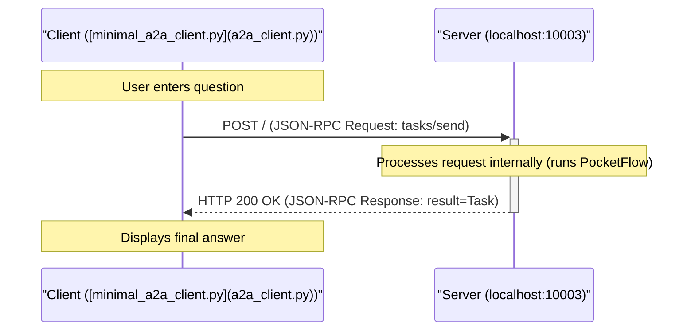

# PocketFlow 智能体与 A2A 协议

此项目演示如何获取使用 PocketFlow 库构建的现有智能体，并使其可通过**智能体到智能体（A2A）通信协议**被其他智能体访问。

此实现基于教程：[A2A Protocol Simply Explained: Here are 3 key differences to MCP!](https://zacharyhuang.substack.com/p/a2a-protocol-simply-explained-here)

## 工作原理：A2A 集成

此项目结合两个主要部分：

1.  **PocketFlow 智能体逻辑：** 原始智能体代码（[`nodes.py`](nodes.py)、[`utils.py`](utils.py)、[`flow.py`](flow.py)）定义内部工作流程（决策 -> 搜索 -> 回答）。此代码直接取自 [PocketFlow 智能体教程](https://github.com/The-Pocket/PocketFlow/tree/main/cookbook/pocketflow-agent)。
2.  **A2A 服务器包装器：** 来自 [google/A2A samples 仓库](https://github.com/google/A2A/tree/main/samples/python)（`common/` 目录）的代码提供必要的基础设施来将智能体托管为符合 A2A 的服务器。*注意：为了教育目的对通用服务器/客户端代码进行了微小修改以添加详细日志。*
3.  **桥梁（[`task_manager.py`](task_manager.py)）：** 自定义 `PocketFlowTaskManager` 类充当桥梁。它接收 A2A 请求（如 `tasks/send`），提取用户查询，运行 PocketFlow `agent_flow`，从流程的共享状态获取最终结果，并将其包装回带有答案作为 `Artifact` 的 A2A `Task` 对象。

这演示了如何通过实现特定的 `TaskManager` 将非 A2A 智能体框架通过 A2A 协议公开。

## 简化的交互序列



## 快速开始

### 前置要求

*   Python 3.10+（由于 A2A `common` 代码中使用的类型提示）
*   OpenAI API 密钥

### 安装

1.  安装依赖项：
    ```bash
    pip install -r requirements.txt
    ```

2. 将您的 OpenAI API 密钥设置为环境变量：

    ```bash
    export OPENAI_API_KEY="your-api-key-here"
    ```

    让我们快速检查以确保您的 API 密钥正常工作：

    ```bash
    python utils.py
    ```
3. 从此目录运行服务器：

    ```bash
    python a2a_server.py --port 10003
    ```

    您应该看到日志表明服务器已在 `http://localhost:10003` 上启动。

4.  在*单独的终端*中运行客户端

    ```bash
    python a2a_client.py --agent-url http://localhost:10003
    ```

5.  按照客户端终端中的说明提问。输入 `:q` 或 `quit` 退出客户端。

## 示例交互日志

**（服务器日志 - 显示内部 PocketFlow 步骤）**

```
2025-04-12 17:20:40,893 - __main__ - INFO - Starting PocketFlow A2A server on http://localhost:10003
INFO:     Started server process [677223]
INFO:     Waiting for application startup.
INFO:     Application startup complete.
INFO:     Uvicorn running on http://localhost:10003 (Press CTRL+C to quit)
2025-04-12 17:20:57,647 - A2AServer - INFO - <- Received Request (ID: d3f3fb93350d47d9a94ca12bb62b656b):
{
  "jsonrpc": "2.0",
  "id": "d3f3fb93350d47d9a94ca12bb62b656b",
  "method": "tasks/send",
  "params": {
    "id": "46c3ce7b941a4fff9b8e3b644d6db5f4",
    "sessionId": "f3e12b8424c44241be891cd4bb8a269f",
    "message": {
      "role": "user",
      "parts": [
        {
          "type": "text",
          "text": "Who won the Nobel Prize in Physics 2024?"
        }
      ]
    },
    "acceptedOutputModes": [
      "text",
      "text/plain"
    ]
  }
}
2025-04-12 17:20:57,647 - task_manager - INFO - Received task send request: 46c3ce7b941a4fff9b8e3b644d6db5f4
2025-04-12 17:20:57,647 - common.server.task_manager - INFO - Upserting task 46c3ce7b941a4fff9b8e3b644d6db5f4
2025-04-12 17:20:57,647 - task_manager - INFO - Running PocketFlow for task 46c3ce7b941a4fff9b8e3b644d6db5f4...
🤔 Agent deciding what to do next...
2025-04-12 17:20:59,213 - httpx - INFO - HTTP Request: POST https://api.openai.com/v1/chat/completions "HTTP/1.1 200 OK"
🔍 Agent decided to search for: 2024 Nobel Prize in Physics winner
🌐 Searching the web for: 2024 Nobel Prize in Physics winner
2025-04-12 17:20:59,974 - primp - INFO - response: https://lite.duckduckgo.com/lite/ 200
📚 Found information, analyzing results...
🤔 Agent deciding what to do next...
2025-04-12 17:21:01,619 - httpx - INFO - HTTP Request: POST https://api.openai.com/v1/chat/completions "HTTP/1.1 200 OK"
💡 Agent decided to answer the question
✍️ Crafting final answer...
2025-04-12 17:21:03,833 - httpx - INFO - HTTP Request: POST https://api.openai.com/v1/chat/completions "HTTP/1.1 200 OK"
✅ Answer generated successfully
2025-04-12 17:21:03,834 - task_manager - INFO - PocketFlow completed for task 46c3ce7b941a4fff9b8e3b644d6db5f4
2025-04-12 17:21:03,834 - A2AServer - INFO - -> Response (ID: d3f3fb93350d47d9a94ca12bb62b656b):
{
  "jsonrpc": "2.0",
  "id": "d3f3fb93350d47d9a94ca12bb62b656b",
  "result": {
    "id": "46c3ce7b941a4fff9b8e3b644d6db5f4",
    "sessionId": "f3e12b8424c44241be881cd4bb8a269f",
    "status": {
      "state": "completed",
      "timestamp": "2025-04-12T17:21:03.834542"
    },
    "artifacts": [
      {
        "parts": [
          {
            "type": "text",
            "text": "The 2024 Nobel Prize in Physics was awarded to John J. Hopfield and Geoffrey Hinton for their foundational discoveries and inventions that have significantly advanced the field of machine learning through the use of artificial neural networks. Their pioneering work has been crucial in the development and implementation of algorithms that enable machines to learn and process information in a manner that mimics human cognitive functions. This advancement in artificial intelligence technology has had a profound impact on numerous industries, facilitating innovations across various applications, from image and speech recognition to self-driving cars."
          }
        ],
        "index": 0
      }
    ],
    "history": []
  }
}
```

**（客户端日志 - 显示请求/响应）**

```
Connecting to agent at: http://localhost:10003
Using Session ID: f3e12b8424c44241be881cd4bb8a269f

Enter your question (:q or quit to exit) > Who won the Nobel Prize in Physics 2024?
Sending task 46c3ce7b941a4fff9b8e3b644d6db5f4...
2025-04-12 17:20:57,643 - A2AClient - INFO - -> Sending Request (ID: d3f3fb93350d47d9a94ca12bb62b656b, Method: tasks/send):
{
  "jsonrpc": "2.0",
  "id": "d3f3fb93350d47d9a94ca12bb62b656b",
  "method": "tasks/send",
  "params": {
    "id": "46c3ce7b941a4fff9b8e3b644d6db5f4",
    "sessionId": "f3e12b8424c44241be881cd4bb8a269f",
    "message": {
      "role": "user",
      "parts": [
        {
          "type": "text",
          "text": "Who won the Nobel Prize in Physics 2024?"
        }
      ]
    },
    "acceptedOutputModes": [
      "text",
      "text/plain"
    ]
  }
}
2025-04-12 17:21:03,835 - httpx - INFO - HTTP Request: POST http://localhost:10003 "HTTP/1.1 200 OK"
2025-04-12 17:21:03,836 - A2AClient - INFO - <- Received HTTP Status 200 for Request (ID: d3f3fb93350d47d9a94ca12bb62b656b)
2025-04-12 17:21:03,836 - A2AClient - INFO - <- Received Success Response (ID: d3f3fb93350d47d9a94ca12bb62b656b):
{
  "jsonrpc": "2.0",
  "id": "d3f3fb93350d47d9a94ca12bb62b656b",
  "result": {
    "id": "46c3ce7b941a4fff9b8e3b644d6db5f4",
    "sessionId": "f3e12b8424c44241be881cd4bb8a269f",
    "status": {
      "state": "completed",
      "timestamp": "2025-04-12T17:21:03.834542"
    },
    "artifacts": [
      {
        "parts": [
          {
            "type": "text",
            "text": "The 2024 Nobel Prize in Physics was awarded to John J. Hopfield and Geoffrey Hinton for their foundational discoveries and inventions that have significantly advanced the field of machine learning through the use of artificial neural networks. Their pioneering work has been crucial in the development and implementation of algorithms that enable machines to learn and process information in a manner that mimics human cognitive functions. This advancement in artificial intelligence technology has had a profound impact on numerous industries, facilitating innovations across various applications, from image and speech recognition to self-driving cars."
          }
        ],
        "index": 0
      }
    ],
    "history": []
  }
}
Task 46c3ce7b941a4fff9b8e3b644d6db5f4 finished with state: completed

Agent Response:
The 2024 Nobel Prize in Physics was awarded to John J. Hopfield and Geoffrey Hinton for their foundational discoveries and inventions that have significantly advanced the field of machine learning through the use of artificial neural networks. Their pioneering work has been crucial in the development and implementation of algorithms that enable machines to learn and process information in a manner that mimics human cognitive functions. This advancement in artificial intelligence technology has had a profound impact on numerous industries, facilitating innovations across various applications, from image and speech recognition to self-driving cars.
```

## 关键 A2A 集成点

要使 PocketFlow 智能体兼容 A2A，以下内容至关重要：

1.  **A2A 服务器（[`common/server/server.py`](common/server/server.py)）：** 使用 Starlette/Uvicorn 的 ASGI 应用程序，监听 HTTP POST 请求，解析 JSON-RPC，并根据 `method` 字段路由请求。
2.  **A2A 数据类型（[`common/types.py`](common/types.py)）：** Pydantic 模型定义 A2A 消息、任务、工件、错误和智能体卡的结构，确保符合 `a2a.json` 规范。
3.  **任务管理器（[`task_manager.py`](task_manager.py)）：** 从通用 `InMemoryTaskManager` 继承的自定义类（`PocketFlowTaskManager`）。其主要角色是实现 `on_send_task` 方法（如果支持流式传输，可能还有其他方法，如 `on_send_task_subscribe`）。此方法：
    *   接收验证的 A2A `SendTaskRequest`。
    *   从请求的 `message` 中提取用户查询（`TextPart`）。
    *   初始化 PocketFlow `shared_data` 字典。
    *   创建并运行 PocketFlow `agent_flow`。
    *   在流程完成后从 `shared_data` 字典检索最终答案。
    *   更新任务的状态（例如，在 `InMemoryTaskManager` 的存储中为 `COMPLETED` 或 `FAILED`）。
    *   将最终答案包装到包含 `TextPart` 的 A2A `Artifact` 中。
    *   为响应构造最终的 A2A `Task` 对象。
4.  **智能体卡（[`a2a_server.py`](a2a_server.py)）：** 定义智能体元数据（名称、描述、URL、能力、技能）的 Pydantic 模型（`AgentCard`），在 `/.well-known/agent.json` 提供。
5.  **服务器入口点（[`a2a_server.py`](a2a_server.py)）：** 初始化 `AgentCard`、`PocketFlowTaskManager` 和 `A2AServer`，然后启动 Uvicorn 服务器进程的脚本。
