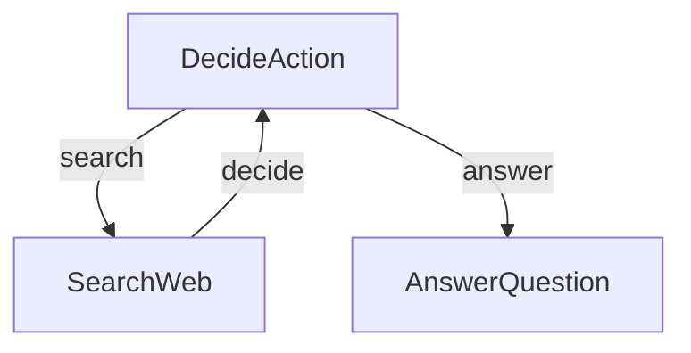

# 研究智能体

此项目演示了一个简单而强大的基于 LLM 的研究智能体。此实现基于教程：[LLM Agents are simply Graph — Tutorial For Dummies](https://zacharyhuang.substack.com/p/llm-agent-internal-as-a-graph-tutorial)。

👉 在浏览器中运行教程：[尝试 Google Colab 笔记本](
https://colab.research.google.com/github/The-Pocket/PocketFlow/blob/main/cookbook/pocketflow-agent/demo.ipynb)

## 功能特性

- 执行网络搜索以收集信息
- 决定何时搜索与何时回答
- 基于研究结果生成全面的答案

## 快速开始

1. 使用此简单命令安装所需的包：
```bash
pip install -r requirements.txt
```

2. 让我们准备好您的 OpenAI API 密钥：

```bash
export OPENAI_API_KEY="your-api-key-here"
```

3. 让我们快速检查以确保您的 API 密钥正常工作：

```bash
python utils.py
```

这将测试 LLM 调用和网络搜索功能。如果您看到响应，说明一切正常！

4. 使用默认问题（关于诺贝尔奖得主）尝试智能体：

```bash
python main.py
```

5. 有迫切问题？使用 `--` 前缀询问任何您想问的问题：

```bash
python main.py --"What is quantum computing?"
```

## 工作原理

魔力通过一个简单但强大的图结构实现，包含三个主要部分：



每个部分的作用如下：
1. **DecideAction**：决定搜索还是回答的大脑
2. **SearchWeb**：出去寻找信息的研究员
3. **AnswerQuestion**：制作最终答案的写作者

以下是每个文件的内容：
- [`main.py`](./main.py)：起点 - 运行整个流程！
- [`flow.py`](./flow.py)：将所有内容连接成一个智能智能体
- [`nodes.py`](./nodes.py)：做出决策并采取行动的构建块
- [`utils.py`](./utils.py)：用于与 LLM 交流和搜索网络的辅助函数
