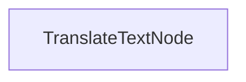

# 批处理翻译流程

此项目演示一个批处理实现，使 LLM 能够同时将文档翻译成多种语言。它旨在高效处理 markdown 文件的翻译，同时保持格式。

## 功能特性

- 并行将 markdown 内容翻译成多种语言
- 将翻译后的文件保存到指定的输出目录

## 快速开始

1. 安装所需的包：
```bash
pip install -r requirements.txt
```

2. 设置您的 API 密钥：
```bash
export ANTHROPIC_API_KEY="your-api-key-here"
```

3. 运行翻译流程：
```bash
python main.py
```

## 工作原理

该实现使用一个处理批处理翻译请求的 `TranslateTextNode`：



`TranslateTextNode`：
1. 为多种语言翻译准备批处理
2. 使用模型并行执行翻译
3. 将翻译后的内容保存到单独的文件
4. 保持原始的 markdown 结构

这种方法展示了 PocketFlow 如何高效地并行处理多个相关任务。

## 示例输出

当您运行翻译流程时，您将看到类似以下的输出：

```
Translated Chinese text
Translated Spanish text
Translated Japanese text
Translated German text
Translated Russian text
Translated Portuguese text
Translated French text
Translated Korean text
Saved translation to translations/README_CHINESE.md
Saved translation to translations/README_SPANISH.md
Saved translation to translations/README_JAPANESE.md
Saved translation to translations/README_GERMAN.md
Saved translation to translations/README_RUSSIAN.md
Saved translation to translations/README_PORTUGUESE.md
Saved translation to translations/README_FRENCH.md
Saved translation to translations/README_KOREAN.md

=== Translation Complete ===
Translations saved to: translations
============================
```

## 文件说明

- [`main.py`](./main.py)：批处理翻译节点的实现
- [`utils.py`](./utils.py)：调用 Anthropic 模型的简单封装器
- [`requirements.txt`](./requirements.txt)：项目依赖项

翻译保存到 `translations` 目录，每个文件根据目标语言命名。
