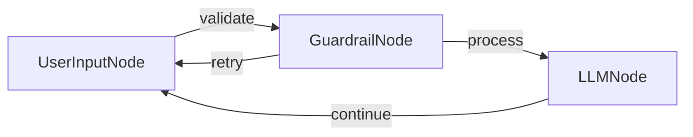

# 带护栏的旅行顾问聊天

使用 PocketFlow 和 OpenAI 的 GPT-4o 模型构建的旅行聊天应用程序，增强了输入验证功能，确保只处理与旅行相关的查询。

## 功能特性

- 旅行顾问聊天机器人，回答关于目的地、规划、住宿等问题
- **主题特定的护栏**，确保只接受与旅行相关的查询

## 运行方式

1. 确保设置了您的 OpenAI API 密钥：
    ```bash
    export OPENAI_API_KEY="your-api-key-here"
    ```
    或者，您可以编辑 `utils.py` 文件直接包含您的 API 密钥。

2. 安装依赖并运行应用程序：
    ```bash
    pip install -r requirements.txt
    python main.py
    ```

## 工作原理



聊天应用程序使用：
- 一个 `UserInputNode`，在 `exec` 方法中收集用户输入
- 一个 `GuardrailNode`，使用以下方式验证查询是否与旅行相关：
  - 基本验证检查（空输入、太短）
  - 基于 LLM 的验证，确定查询是否与旅行相关
- 一个 `LLMNode`，使用 GPT-4o 和旅行顾问系统提示词处理有效的旅行查询
- 流程连接，在处理前将输入路由通过验证，并处理非旅行相关查询的重试

## 文件说明

- [`main.py`](./main.py)：节点和聊天流程的实现
- [`utils.py`](./utils.py)：调用 OpenAI API 的工具

## 示例输出

```
Welcome to the Travel Advisor Chat! Type 'exit' to end the conversation.

You: Plan my trip to Thailand

Travel Advisor: Thailand offers a blend of vibrant cities, serene beaches, and rich culture. Begin in Bangkok to explore the Grand Palace and local markets. Head north to Chiang Mai for temples and elephant sanctuaries. Fly south to the islands; Phuket or Koh Samui for beaches, diving, and nightlife. Consider visiting during the cool season (November-February) for pleasant weather. Accommodation ranges from budget hostels to luxury resorts. Internal flights, trains, and buses connect major destinations. Don't miss local cuisine, from street food to fine dining. Ensure your passport is valid for six months and consider travel insurance for peace of mind. Enjoy!

You: exit

Goodbye! Safe travels!
```

```
Welcome to the Travel Advisor Chat! Type 'exit' to end the conversation.

You: How to study large language models?

Travel Advisor: The query is not related to travel advice, destinations, planning, or other travel topics. It is about studying large language models, which is a topic related to artificial intelligence and machine learning.

You: exit

Goodbye! Safe travels!
```
