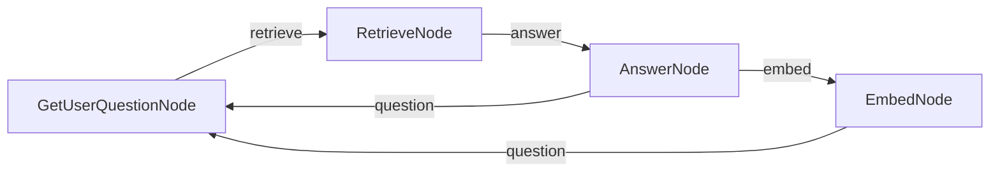

# PocketFlow 记忆聊天

使用 PocketFlow 的具有记忆检索功能的聊天应用程序。此示例维护最近对话的滑动窗口，同时根据上下文检索相关的过去对话。

此实现基于教程：[Build AI Agent Memory From Scratch — Tutorial For Dummies](https://zacharyhuang.substack.com/p/build-ai-agent-memory-from-scratch)。

## 功能特性

- 维护最近 3 对对话的窗口
- 使用嵌入向量归档较旧的对话
- 使用向量相似性检索最相关的过去对话
- 结合最近上下文（3 对）和检索上下文（1 对）以获得更好的响应

## 运行方式

1. 确保设置了您的 OpenAI API 密钥：
    ```bash
    export OPENAI_API_KEY="your-api-key-here"
    ```

2. 安装依赖并运行应用程序：
    ```bash
    pip install -r requirements.txt
    python main.py
    ```

## 工作原理



聊天应用程序使用：
- 四个专门节点：
  - `GetUserQuestionNode`：处理交互式用户输入
  - `RetrieveNode`：使用向量相似性找到相关的过去对话
  - `AnswerNode`：使用最近和检索的上下文生成响应
  - `EmbedNode`：使用嵌入向量归档较旧的对话
- 滑动窗口方法，仅在活动上下文中维护最近 3 对对话

## 文件说明

- [`nodes.py`](./nodes.py)：四个节点实现，清晰地分离关注点
- [`flow.py`](./flow.py)：聊天流程结构定义
- [`main.py`](./main.py)：运行演示的入口点
- [`utils/`](./utils/)：用于嵌入、LLM 调用和向量操作的实用函数

## 示例输出

```
==================================================
PocketFlow Chat with Memory
==================================================
This chat keeps your 3 most recent conversations
and brings back relevant past conversations when helpful
Type 'exit' to end the conversation
==================================================
Welcome to the interactive chat! Type 'exit' to end the conversation.

You: remember, my cat name is Whiskers and she only drinks from running water taps

Assistant: Got it! Whiskers only drinks from running water taps. If you have any questions or need advice related to her, feel free to ask!

You: remember, I have a peanut allergy but I can eat almonds and cashews without problems

Assistant: Understood! You have a peanut allergy but can safely eat almonds and cashews. If you need any assistance or information related to your dietary preferences or restrictions, just let me know!

You: remember, my anniversary is June 17th and I always forget to buy a gift until the last minute

Assistant: Got it! Your anniversary is on June 17th, and you often remember to buy a gift at the last minute. If you'd like, I can help you brainstorm gift ideas or set reminders as the date approaches!

You: remember, I lived in Portugal for 3 years when I was a child and still speak some Portuguese

Assistant: That's great to know! You lived in Portugal for three years during your childhood and still speak some Portuguese. If you ever want to practice or need help with anything related to Portuguese language or culture, feel free to ask!
✅ Added conversation to index at position 0
✅ Index now contains 1 conversations

You: remember, my favorite dessert is tiramisu but only if it's made with real mascarpone cheese
🔍 Finding relevant conversation for: remember, my favorite dessert ...
📄 Retrieved conversation (distance: 0.5008)

Assistant: Got it! Your favorite dessert is tiramisu, but only when it's made with real mascarpone cheese. If you ever need recommendations or recipes, just let me know!
✅ Added conversation to index at position 1
✅ Index now contains 2 conversations

You: remember, I collect vintage mechanical watches and my most valuable one is a 1965 Omega Seamaster
🔍 Finding relevant conversation for: remember, I collect vintage me...
📄 Retrieved conversation (distance: 0.5374)

Assistant: Got it! You collect vintage mechanical watches, and your most valuable piece is a 1965 Omega Seamaster. If you have questions about watches or need assistance with your collection, feel free to reach out!
✅ Added conversation to index at position 2
✅ Index now contains 3 conversations

You: what's my cat name?
🔍 Finding relevant conversation for: what's my cat name?...
📄 Retrieved conversation (distance: 0.3643)

Assistant: Your cat's name is Whiskers.
✅ Added conversation to index at position 3
✅ Index now contains 4 conversations
```
