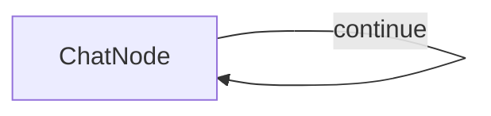

# 简单 PocketFlow 聊天应用

使用 PocketFlow 和 OpenAI 的 GPT-4o 模型构建的基本聊天应用程序。

## 功能特性

- 终端中的对话聊天界面
- 维护完整的对话历史以保持上下文
- 简单实现，展示 PocketFlow 的节点和流程概念

## 运行方式

1. 确保设置了您的 OpenAI API 密钥：
    ```bash
    export OPENAI_API_KEY="your-api-key-here"
    ```
    或者，您可以编辑 `utils.py` 文件直接包含您的 API 密钥。

2. 安装依赖并运行应用程序：
    ```bash
    pip install -r requirements.txt
    python main.py
    ```

## 工作原理



聊天应用程序使用：
- 一个具有自循环的 `ChatNode`，该节点：
  - 在 `prep` 方法中获取用户输入
  - 将完整对话历史发送到 GPT-4o
  - 将响应添加到对话历史
  - 循环返回继续聊天，直到用户输入 'exit'

## 文件说明

- [`main.py`](./main.py)：ChatNode 和聊天流程的实现
- [`utils.py`](./utils.py)：调用 OpenAI API 的简单封装器
