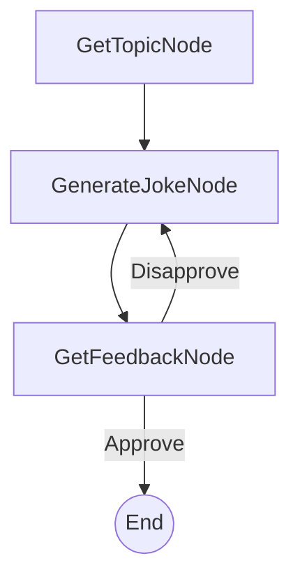

# PocketFlow 命令行笑话生成器（人机交互示例）

一个简单、交互式的命令行应用程序，基于用户提供的主题和直接的人工反馈生成笑话。这作为 PocketFlow 编排的人机交互（HITL）工作流程的清晰示例。

## 功能特性

- **交互式笑话生成**：询问任何主题的笑话。
- **人机交互反馈**：不喜欢笑话？您的反馈直接影响下一次生成尝试。
- **极简设计**：使用 PocketFlow 进行 HITL 任务的直接示例。
- **由 LLM 驱动**：（使用 Anthropic Claude 通过 API 调用生成笑话）。

## 快速开始

此项目是 PocketFlow 教程示例的一部分。假设您已经克隆了 [PocketFlow 仓库](https://github.com/the-pocket/PocketFlow)并在 `cookbook/pocketflow-cli-hitl` 目录中。

1.  **安装所需的依赖项**：
    ```bash
    pip install -r requirements.txt
    ```

2.  **设置您的 Anthropic API 密钥**：
    应用程序使用 Anthropic Claude 生成笑话。您需要将 API 密钥设置为环境变量。
    ```bash
    export ANTHROPIC_API_KEY="your-anthropic-api-key-here"
    ```
    您可以通过直接运行 `call_llm.py` 实用程序来测试它是否正常工作：
    ```bash
    python utils/call_llm.py
    ```

3.  **运行笑话生成器**：
    ```bash
    python main.py
    ```

## 工作原理

系统使用一个简单的 PocketFlow 工作流程：



1.  **GetTopicNode**：提示用户输入笑话主题。
2.  **GenerateJokeNode**：将主题（以及任何先前不喜欢的笑话作为上下文）发送到 LLM 生成新笑话。
3.  **GetFeedbackNode**：向用户显示笑话并询问他们是否喜欢。
    *   如果是**yes**（批准），应用程序结束。
    *   如果是**no**（不批准），记录不喜欢的笑话，流程循环回 `GenerateJokeNode` 重试。

## 示例输出

以下是与笑话生成器交互的示例：

```
Welcome to the Command-Line Joke Generator!
What topic would you like a joke about? Pocket Flow: 100-line LLM framework

Joke: Pocket Flow: Finally, an LLM framework that fits in your pocket! Too bad your model still needs a data center.
Did you like this joke? (yes/no): no
Okay, let me try another one.

Joke: Pocket Flow: A 100-line LLM framework where 99 lines are imports and the last line is `print("TODO: implement intelligence")`.
Did you like this joke? (yes/no): yes
Great! Glad you liked it.

Thanks for using the Joke Generator!
```

## 文件说明

-   [`main.py`](./main.py)：应用程序入口点。
-   [`flow.py`](./flow.py)：定义 PocketFlow 图和节点连接。
-   [`nodes.py`](./nodes.py)：包含 `GetTopicNode`、`GenerateJokeNode` 和 `GetFeedbackNode` 的定义。
-   [`utils/call_llm.py`](./utils/call_llm.py)：与 LLM（Anthropic Claude）交互的实用函数。
-   [`requirements.txt`](./requirements.txt)：列出项目依赖项。
-   [`docs/design.md`](./docs/design.md)：此应用程序的设计文档。
