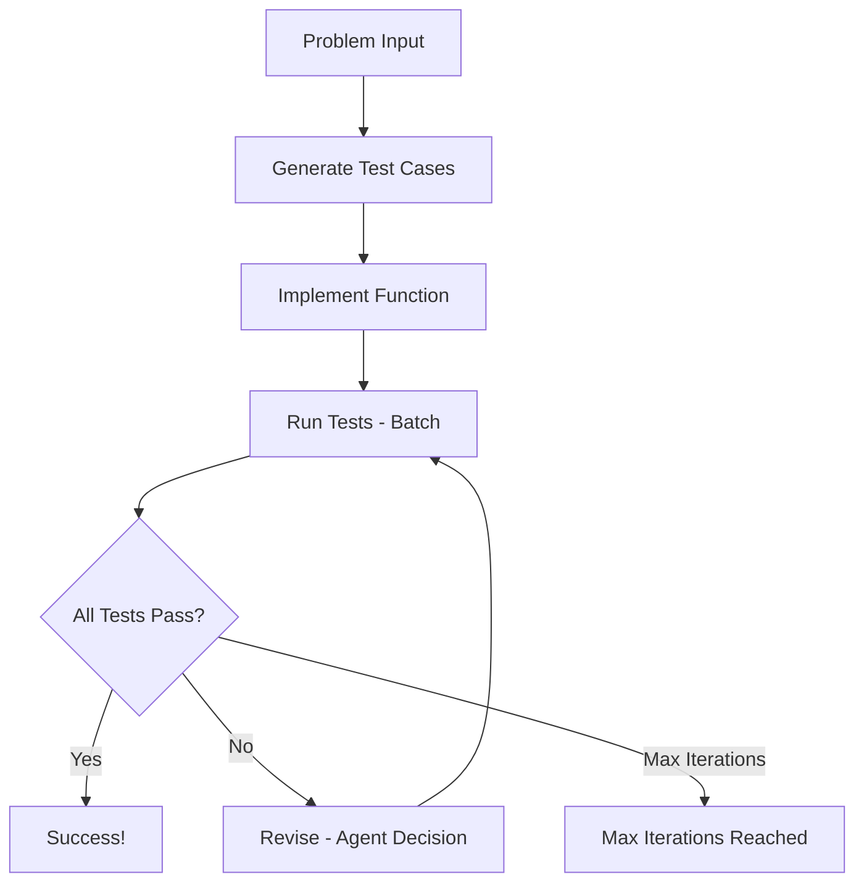

# PocketFlow 代码生成器

智能 AI 系统，接受 LeetCode 风格的编程问题，自动生成全面的测试用例，实现解决方案，并迭代改进它们直到所有测试通过。

- 查看[Substack 文章教程](https://pocketflow.substack.com/p/build-your-own-ai-code-generator)了解更多！

## 功能特性

- **自动测试用例生成**：创建包括边界情况在内的多样化测试用例
- **智能代码实现**：生成带有适当算法的 `run_code` 函数
- **迭代改进**：分析失败并决定是否修订测试或代码
- **丰富的调试输出**：详细的进度跟踪和验证

## 快速开始

1. 安装所需的依赖项：
```bash
pip install -r requirements.txt
```

2. 设置您的 Anthropic API 密钥：
    ```bash
    export ANTHROPIC_API_KEY="your-api-key-here"
    ```
    测试您的 API 密钥是否正常工作：
    ```bash
    python utils/call_llm.py
    ```

3. 使用默认的两数之和问题运行代码生成器：
```bash
python main.py
```

4. 或提供您自己的问题：
```bash
python main.py "Reverse a linked list. Given the head of a singly linked list, reverse the list and return the reversed list."
```

## 工作原理

系统遵循结合**智能体**和**工作流程**设计模式的智能工作流程：



### 流程

1. **GenerateTestCases**：从问题描述创建 5-7 个全面的测试用例
2. **ImplementFunction**：基于问题和测试用例编写 `run_code` 函数
3. **RunTests**：使用批处理对所有测试用例执行函数
4. **Revise**：分析失败并做出智能决策来修订测试用例和/或函数代码
5. **Loop**：继续直到所有测试通过或达到最大迭代次数

## 示例输出

以下是运行两数之和示例时您将看到的内容：

```
Starting PocketFlow Code Generator...

=== Generated 7 Test Cases ===
1. Basic case - solution at beginning
   input: {'nums': [2, 7, 11, 15], 'target': 9}
   expected: [0, 1]
2. Basic case - solution in middle
   input: {'nums': [3, 2, 4], 'target': 6}
   expected: [1, 2]
3. Edge case - minimum array size with duplicates
   input: {'nums': [3, 3], 'target': 6}
   expected: [0, 1]
4. Case with negative numbers
   input: {'nums': [-1, -2, -3, -4, -5], 'target': -8}
   expected: [2, 4]
5. Case with zero and negative target
   input: {'nums': [0, 4, 3, 0], 'target': 0}
   expected: [0, 3]
6. Case with solution at the end
   input: {'nums': [1, 2, 3, 4, 5, 6], 'target': 11}
   expected: [4, 5]
7. Larger array case
   input: {'nums': [5, 75, 25, 45, 42, 2, 11, 9, 55, 12], 'target': 14}
   expected: [2, 6]

=== Implemented Function ===
def run_code(nums, target):
    # Dictionary to store number -> index mapping
    num_to_index = {}

    # Iterate through the array
    for i, num in enumerate(nums):
        # Calculate what number we need to reach the target
        complement = target - num

        # Check if the complement exists in our map
        if complement in num_to_index:
            # Found the pair! Return indices
            return [num_to_index[complement], i]

        # Store current number and its index
        num_to_index[num] = i

    # Should never reach here given problem constraints
    return []

=== Test Results: 6/7 Passed ===
Failed tests:
1. Larger array case:
   error: Expected [2, 6], got [0, 7]
   expected: [2, 6]

=== Revisions (Iteration 1) ===
Revising test cases:
  Test 7: 'Larger array case' -> 'Larger array case'
    old input: {'nums': [5, 75, 25, 45, 42, 2, 11, 9, 55, 12], 'target': 14}
    new input: {'nums': [5, 75, 25, 45, 42, 2, 11, 9, 55, 12], 'target': 14}
    old expected: [2, 6]
    new expected: [0, 7]

=== Test Results: 7/7 Passed ===
```

## 关键功能

### 智能决策
**Revise** 节点充当智能体，分析测试失败并决定是否：
- 修复测试用例（如果它们有错误的预期输出）
- 修复函数实现（如果逻辑错误）
- 或两者兼而有之

### 带验证的结构化输出
所有 LLM 交互使用 YAML 格式，包含：
- **推理字段**：透明的决策过程
- **验证断言**：确保输出匹配预期结构
- **丰富的调试**：所有步骤的综合日志

### 批处理
**RunTests** 节点使用 PocketFlow 的 BatchNode 来高效地并行测试所有测试用例的函数。

## 文件说明

- [`main.py`](./main.py)：带有示例两数之和问题的入口点
- [`flow.py`](./flow.py)：将所有节点连接到完整工作流程
- [`nodes.py`](./nodes.py)：带有验证和调试的核心逻辑节点
- [`utils/call_llm.py`](./utils/call_llm.py)：Anthropic Claude API 封装器
- [`utils/code_executor.py`](./utils/code_executor.py)：安全的 Python 代码执行工具
- [`doc/design.md`](./doc/design.md)：详细的系统设计文档

## 使用的设计模式

- **[工作流程](https://the-pocket.github.io/PocketFlow/design_pattern/workflow.html)**：测试生成 → 编码 → 测试的顺序步骤
- **[智能体](https://the-pocket.github.io/PocketFlow/design_pattern/agent.html)**：测试失败时的智能决策
- **[批处理](https://the-pocket.github.io/PocketFlow/core_abstraction/batch.html)**：高效并行测试执行
- **[结构化输出](https://the-pocket.github.io/PocketFlow/design_pattern/structure.html)**：用于可靠 LLM 输出的 YAML 验证
