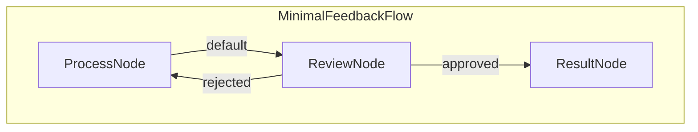

# PocketFlow Web 人机交互（HITL）反馈服务

此项目演示使用 PocketFlow、FastAPI 和服务器发送事件（SSE）的人机交互工作流程的最小 Web 应用程序。用户可以提交文本，对其进行处理（模拟），审查输出，并批准或拒绝它，可能会触发重新处理直到批准。

<p align="center">
  
</p>

## 功能特性

-   **Web UI：** 用于提交任务和提供反馈的简单界面。
-   **PocketFlow 工作流程：** 管理处理 → 审查 → 结果/重新处理逻辑。
-   **FastAPI 后端：** 异步提供 UI 和处理 API 请求。
-   **服务器发送事件（SSE）：** 无需轮询即可向客户端提供实时状态更新。

## 如何运行

1.  安装依赖项：
    ```bash
    pip install -r requirements.txt
    ```

2.  运行 FastAPI 服务器：
    使用 Uvicorn（或其他 ASGI 服务器）：
    ```bash
    uvicorn server:app --reload --port 8000
    ```
    *（`--reload` 标志对开发很有用。）*

3.  访问 Web UI：
    打开 Web 浏览器并导航到 `http://127.0.0.1:8000`。

4.  使用应用程序：
    *   在文本区域中输入文本并点击"提交"。
    *   观察通过 SSE 推送的状态更新。
    *   当提示时（"waiting_for_review"），使用"批准"或"拒绝"按钮。
    *   如果拒绝，流程循环返回。如果批准，显示最终结果。

## 工作原理

应用程序使用 PocketFlow 定义和执行反馈循环工作流程。FastAPI 处理 Web 请求并管理实时 SSE 通信。

**PocketFlow 工作流程：**

核心逻辑由 `flow.py` 中定义的 `AsyncFlow` 编排：



1.  **`ProcessNode`**：接收输入文本，调用最小的 `process_task` 工具，并存储输出。
2.  **`ReviewNode`（异步）**：
    *   将带有处理输出的"waiting_for_review"状态推送到 SSE 队列。
    *   异步等待外部信号（由 `/feedback` API 端点触发）。
    *   根据接收到的反馈（"approved"或"rejected"）确定流程中的下一步。如果批准，存储结果。
3.  **`ResultNode`**：记录最终批准的结果。

**FastAPI 和 SSE 集成：**

*   `/submit` 端点创建唯一任务，初始化 PocketFlow `shared` 状态（包括用于审查的 `asyncio.Event` 和用于 SSE 的 `asyncio.Queue`），并使用 `BackgroundTasks` 调度流程执行。
*   流程内的节点（特别是 `ReviewNode` 的 prep 逻辑）将状态更新放入任务特定的 `sse_queue`。
*   `/stream/{task_id}` 端点使用 `StreamingResponse` 从任务的 `sse_queue` 读取，并通过服务器发送事件将格式化状态更新推送到连接的客户端。
*   `/feedback/{task_id}` 端点接收人工决策，更新 `shared` 状态，并设置 `asyncio.Event` 以取消阻塞等待的 `ReviewNode`。

此设置允许解耦的工作流程逻辑（PocketFlow）和 Web 交互层（FastAPI），并向用户高效推送实时更新。

## 文件说明

-   [`server.py`](./server.py)：处理 HTTP 请求、SSE、状态管理和后台任务调度的主要 FastAPI 应用程序。
-   [`nodes.py`](./nodes.py)：定义工作流程步骤的 PocketFlow `Node` 类（`ProcessNode`、`ReviewNode`、`ResultNode`）。
-   [`flow.py`](./flow.py)：定义将节点连接成反馈循环的 PocketFlow `AsyncFlow`。
-   [`utils/process_task.py`](./utils/process_task.py)：包含任务处理的最小模拟函数。
-   [`templates/index.html`](./templates/index.html)：前端用户界面的 HTML 结构。
-   [`static/style.css`](./static/style.css)：用于前端样式的基本 CSS。
-   [`requirements.txt`](./requirements.txt)：项目依赖项（FastAPI、Uvicorn、Jinja2、PocketFlow）。
