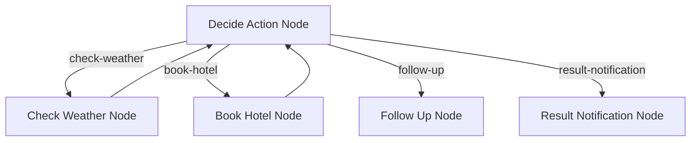

# PocketFlow Gradio HITL 示例

基于 Web 的应用程序，演示使用 PocketFlow 和 Gradio 进行人机交互（HITL）工作流程编排。此示例提供了交互式界面，供用户与 AI 驱动的任务交互，同时保持人工监督和反馈。

## 功能特性

- **基于 Web 的界面**：使用 Gradio 构建，提供可访问且用户友好的体验
- **人机交互集成**：将人工反馈无缝集成到 AI 工作流程中
- **现代 UI**：清洁直观的界面，提供更好的用户交互
- **由 LLM 驱动**：利用 OpenAI 的模型进行智能任务处理
- **流程可视化**：节点执行序列和工作流程进度的实时可视化
- **交互式调试**：通过视觉反馈监控和理解决策过程

## 快速开始

此项目是 PocketFlow 教程示例的一部分。假设您已经克隆了 [PocketFlow 仓库](https://github.com/the-pocket/PocketFlow)并在 `cookbook/pocketflow-gradio-hitl` 目录中。

1. **安装所需的依赖项**：
    ```bash
    pip install -r requirements.txt
    ```

2. **设置您的 OpenAI API 密钥**：
    应用程序使用 OpenAI 模型进行处理。您需要将 API 密钥设置为环境变量：
    ```bash
    export OPENAI_API_KEY="your-openai-api-key-here"
    ```

3. **运行应用程序**：
    ```bash
    python main.py
    ```
    这将启动 Gradio Web 界面，通常可在 `http://localhost:7860` 访问

## 工作原理

系统实现带有 Web 界面的 PocketFlow 工作流程：



工作流程包含以下节点：

1. **Decide Action Node**：中央决策节点，根据用户输入和上下文确定下一个操作
2. **Check Weather Node**：为指定城市和日期提供天气信息
3. **Book Hotel Node**：处理酒店预订请求，包含入住和退房日期
4. **Follow Up Node**：通过提出澄清问题或处理范围外请求来管理用户交互
5. **Result Notification Node**：交付操作结果并提供额外帮助

流程通过一系列定向连接编排：
- Decide Action 节点可以触发天气检查、酒店预订、跟进或结果通知
- 天气检查和酒店预订可以反馈到 Decide Action 节点进行进一步处理
- 跟进和结果通知节点提供工作流程中的最后步骤

### 流程可视化

应用程序提供工作流程执行的实时可视化：
- 节点激活序列按时间顺序显示
- 用户可以看到正在采取哪些决策路径
- 可视化有助于理解 AI 的决策过程


## 示例输出

以下是预订酒店的示例：


以下是对话中改变意图的示例：


## 文件说明

- [`main.py`](./main.py)：应用程序入口点和 Gradio 界面设置
- [`flow.py`](./flow.py)：定义 PocketFlow 图和节点连接
- [`nodes.py`](./nodes.py)：包含工作流程的节点定义
- [`utils/`](./utils/)：包含实用函数和辅助模块
- [`requirements.txt`](./requirements.txt)：列出项目依赖项

## 要求

- Python 3.8+
- PocketFlow >= 0.0.2
- Gradio >= 5.29.1
- OpenAI >= 1.78.1
