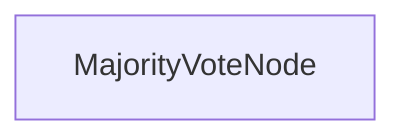

# 多数投票推理

此项目演示一个多数投票实现，使 LLM 能够通过聚合多个独立尝试来解决复杂推理问题。它旨在通过基于共识的推理提高问题解决准确性。

## 功能特性

- 通过多次尝试提高模型在复杂问题上的可靠性
- 与 Claude 3.7 Sonnet 等模型配合使用
- 解决单次尝试经常失败的问题
- 提供详细的推理轨迹以进行验证
- 使用共识方法减少偶发性推理错误的影响

## 快速开始

1. 安装所需的包：
```bash
pip install -r requirements.txt
```

2. 设置您的 API 密钥：
```bash
export ANTHROPIC_API_KEY="your-api-key-here"
```

3. 运行测试问题以查看多数投票的实际效果：
```bash
python main.py
```

4. 尝试您自己的推理问题：
```bash
python main.py --problem "Your complex reasoning problem here" --tries 5
```

## 工作原理

该实现使用一个处理多次尝试并寻找共识的 MajorityVoteNode：



MajorityVoteNode：
1. 对同一问题进行多次独立尝试
2. 从每次尝试中收集结构化答案
3. 确定最频繁的答案作为最终解决方案
4. 返回共识答案

这种方法有助于克服单个尝试中可能出现的偶发性推理错误。

## 示例问题

来自[量化面试](https://www.youtube.com/watch?v=SCP7JptxPU0)的示例问题：

```
您在一个鞋厂工作。您面前有三双鞋（六个单独的鞋子），尺码如下：两个4号，两个5号，和两个6号。工厂将"可接受的一双"定义为尺码相差最多一号的鞋子（例如，5号和6号是可接受的一双）。如果您闭上眼睛随机抽取三双鞋而不放回，那么最终抽到三双可接受鞋子的概率是多少？
```

以下是多数投票方法如何使用 Claude 3.7 Sonnet 解决这个复杂问题的示例：

```
========================
All structured answers: ['0.333', '0.333', '0.333', '0.6', '0.333']
Majority vote => 0.333
Frequency => 4
========================

=== Final Answer ===
0.333
====================
```

这表明 5 次尝试中有 4 次得出相同答案（0.333），该答案被选为最终解决方案。

## 文件说明

- [`main.py`](./main.py)：多数投票节点和流程的实现
- [`utils.py`](./utils.py)：调用 Anthropic 模型的简单封装器
