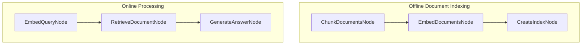

# 检索增强生成（RAG）

此项目演示一个简化的 RAG 系统，根据用户查询检索相关文档并使用 LLM 生成答案。此实现基于教程：[Retrieval Augmented Generation (RAG) from Scratch — Tutorial For Dummies](https://zacharyhuang.substack.com/p/retrieval-augmented-generation-rag)。

## 功能特性

- 用于处理长文本的文档分块
- 基于 FAISS 的向量文档检索
- 基于 LLM 的答案生成

## 如何运行

1. 设置您的 API 密钥：
   ```bash
   export OPENAI_API_KEY="your-api-key-here"
   ```
   或直接在 `utils.py` 中更新

   让我们快速检查以确保您的 API 密钥正常工作：

   ```bash
   python utils.py
   ```

2. 安装并运行默认查询：
   ```bash
   pip install -r requirements.txt
   python main.py
   ```

3. 使用示例查询运行应用程序：

   ```bash
   python main.py --"How does the Q-Mesh protocol achieve high transaction speeds?"
   ```

## 工作原理

魔力通过使用 PocketFlow 实现的两个阶段管道发生：



每个部分的作用如下：
1. **ChunkDocumentsNode**：将文档分解为更小的块以改善检索
2. **EmbedDocumentsNode**：将文档块转换为向量表示
3. **CreateIndexNode**：从嵌入创建可搜索的 FAISS 索引
4. **EmbedQueryNode**：将用户查询转换为相同的向量空间
5. **RetrieveDocumentNode**：使用向量搜索找到最相似的文档
6. **GenerateAnswerNode**：使用 LLM 基于检索的内容生成答案

## 示例输出

```
✅ Created 5 chunks from 5 documents
✅ Created 5 document embeddings
🔍 Creating search index...
✅ Index created with 5 vectors
🔍 Embedding query: How to install PocketFlow?
🔎 Searching for relevant documents...
📄 Retrieved document (index: 0, distance: 0.3427)
📄 Most relevant text: "Pocket Flow is a 100-line minimalist LLM framework
        Lightweight: Just 100 lines. Zero bloat, zero dependencies, zero vendor lock-in.
        Expressive: Everything you love—(Multi-)Agents, Workflow, RAG, and more.
        Agentic Coding: Let AI Agents (e.g., Cursor AI) build Agents—10x productivity boost!
        To install, pip install pocketflow or just copy the source code (only 100 lines)."

🤖 Generated Answer:
To install PocketFlow, use the command `pip install pocketflow` or simply copy its 100 lines of source code.
```
