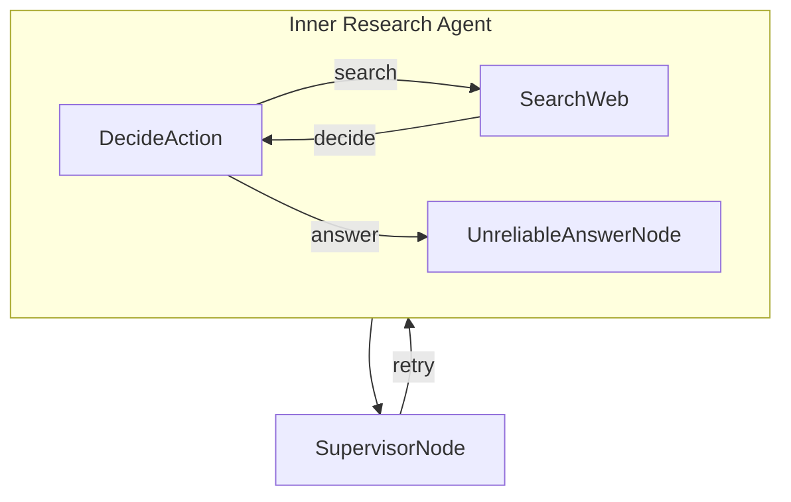

# 研究监督者

此项目演示一个监督者，监督不可靠的[研究智能体](../pocketflow-agent)以确保高质量答案。

## 功能特性

- 评估响应的质量和相关性
- 拒绝无意义或不可靠的答案
- 请求新答案直到产生质量响应

## 快速开始

1. 使用此简单命令安装所需的包：
```bash
pip install -r requirements.txt
```

2. 让我们准备好您的 OpenAI API 密钥：

```bash
export OPENAI_API_KEY="your-api-key-here"
```

3. 让我们快速检查以确保您的 API 密钥正常工作：

```bash
python utils.py
```

这将测试 LLM 调用和网络搜索功能。如果您看到响应，说明一切正常！

4. 使用默认问题（关于诺贝尔奖得主）尝试智能体：

```bash
python main.py
```

5. 有迫切问题？使用 `--` 前缀询问任何您想问的问题：

```bash
python main.py --"What is quantum computing?"
```

## 工作原理

魔力通过一个简单但强大的图结构实现，包含这些主要组件：



每个部分的作用如下：
1. **DecideAction**：根据当前上下文决定搜索还是回答的大脑
2. **SearchWeb**：使用网络搜索出去寻找信息的研究员
3. **UnreliableAnswerNode**：生成答案（有 50% 的机会不可靠）
4. **SupervisorNode**：质量控制，验证答案并拒绝无意义的答案

## 示例输出

```
🤔 Processing question: Who won the Nobel Prize in Physics 2024?
🤔 Agent deciding what to do next...
🔍 Agent decided to search for: Nobel Prize in Physics 2024 winner
🌐 Searching the web for: Nobel Prize in Physics 2024 winner
📚 Found information, analyzing results...
🤔 Agent deciding what to do next...
💡 Agent decided to answer the question
🤪 Generating unreliable dummy answer...
✅ Answer generated successfully
    🔍 Supervisor checking answer quality...
    ❌ Supervisor rejected answer: Answer appears to be nonsensical or unhelpful
🤔 Agent deciding what to do next...
💡 Agent decided to answer the question
✍️ Crafting final answer...
✅ Answer generated successfully
    🔍 Supervisor checking answer quality...
    ✅ Supervisor approved answer: Answer appears to be legitimate

🎯 Final Answer:
The Nobel Prize in Physics for 2024 was awarded jointly to John J. Hopfield and Geoffrey Hinton. They were recognized "for foundational discoveries and inventions that enable machine learning with artificial neural networks." Their work has been pivotal in the field of artificial intelligence, specifically in developing the theories and technologies that support machine learning using artificial neural networks. John Hopfield is associated with Princeton University, while Geoffrey Hinton is connected to the University of Toronto. Their achievements have laid essential groundwork for advancements in AI and its widespread application across various domains.
```

## 文件说明

- [`main.py`](./main.py)：起点 - 运行整个流程！
- [`flow.py`](./flow.py)：将所有内容连接成带有监督的智能智能体
- [`nodes.py`](./nodes.py)：做出决策、采取行动和验证答案的构建块
- [`utils.py`](./utils.py)：用于与 LLM 交流和搜索网络的辅助函数
