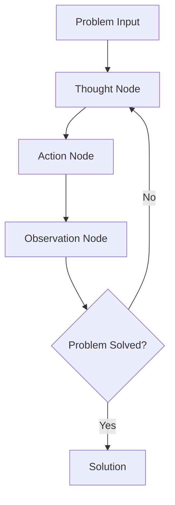

# PocketFlow TAO（思维-行动-观察）

一个强大的模式，使 AI 智能体能够通过结构化思维、行动执行和结果观察来解决复杂问题。此示例演示如何使用 PocketFlow 实现 TAO 模式。

## 项目结构

```
.
├── flow.py        # TAO 模式的 PocketFlow 实现
├── main.py        # 主要应用程序入口点
├── nodes.py       # TAO 节点定义
├── requirements.txt # 项目依赖项
└── README.md      # 项目文档
```

## 概述

TAO 模式包含三个关键步骤：
1. **思维**：智能体深入分析问题并形成解决策略
2. **行动**：基于思维执行具体行动
3. **观察**：评估结果并收集反馈

此循环继续直到问题解决或满足终止条件。

## 环境配置

1. 创建虚拟环境：
```bash
python -m venv venv
source venv/bin/activate  # Windows 系统：venv\Scripts\activate
```

2. 安装依赖项：
```bash
pip install -r requirements.txt
```

3. 设置 API 密钥（如果使用特定的 LLM 服务）：
```bash
export OPENAI_API_KEY="your-api-key-here"
# 或在代码中设置
```

## 如何运行

执行示例：
```bash
python main.py
```

## 工作原理

TAO 模式在 PocketFlow 中实现为流程，每个步骤由专门节点处理：



每个 TAO 循环为问题解决过程生成新的见解，允许 AI 迭代地接近最优解决方案。

## 使用案例

- 复杂问题解决
- 多步推理任务
- 需要迭代改进的项目
- 强化学习风格的 AI 应用程序

## 示例输出

```
Query: I need to understand the latest developments in artificial intelligence

🤔 Thought 1: Decided to execute search
🚀 Executing action: search, input: latest developments in artificial intelligence 2023
✅ Action completed, result obtained
👁️ Observation: The search result indicates that information was r...
🎯 Final Answer: As of October 2023, some of the latest developments in artificial intelligence include advances in large language models like GPT-4, increased focus on AI alignment and safety, improvements in reinforcement learning, and the integration of AI into more industries such as healthcare, finance, and autonomous vehicles. Researchers are also exploring ethical considerations and regulatory frameworks to ensure responsible AI deployment. For the most current updates beyond this date, I recommend checking recent publications, official AI research organization releases, or news sources specializing in technology.

Flow ended, thank you for using!

Final Answer:
As of October 2023, some of the latest developments in artificial intelligence include advances in large language models like GPT-4, increased focus on AI alignment and safety, improvements in reinforcement learning, and the integration of AI into more industries such as healthcare, finance, and autonomous vehicles. Researchers are also exploring ethical considerations and regulatory frameworks to ensure responsible AI deployment. For the most current updates beyond this date, I recommend checking recent publications, official AI research organization releases, or news sources specializing in technology.
```

## 高级用法

TAO 模式可以通过以下方式扩展：
- 添加记忆组件来存储过去的思维和观察。
- 实现自适应行动选择策略。
- 集成外部工具和 API。
- 添加人工反馈循环。
- 添加最大尝试次数来控制迭代。

## 更多资源

- [PocketFlow 文档](https://the-pocket.github.io/PocketFlow/)
- [通过思维-行动-观察循环理解 AI 智能体](https://huggingface.co/learn/agents-course/en/unit1/agent-steps-and-structure)
