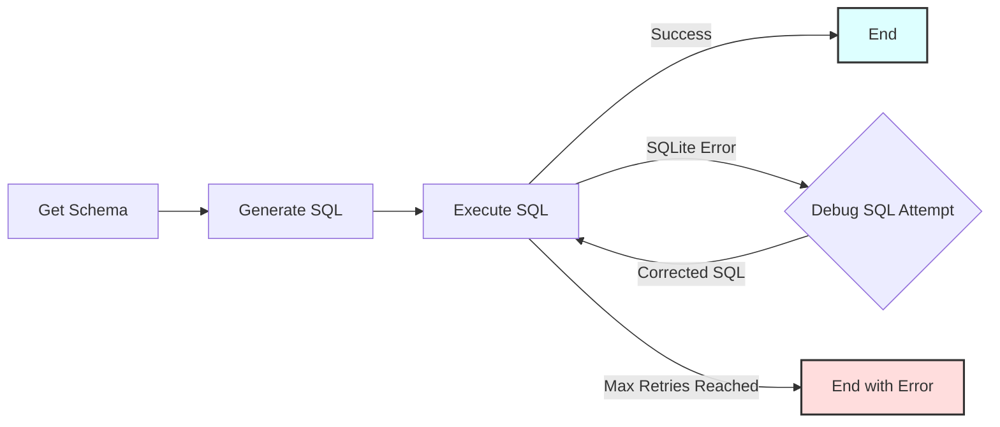

# 文本到 SQL 工作流程

演示文本到 SQL 工作流程的 PocketFlow 示例，将自然语言问题转换为 SQLite 数据库的可执行 SQL 查询，包括用于失败查询的基于 LLM 的调试循环。

- 查看[Substack 文章教程](https://zacharyhuang.substack.com/p/text-to-sql-from-scratch-tutorial)了解更多！

## 功能特性

-   **架构感知**：自动检索数据库架构以为 LLM 提供上下文。
-   **基于 LLM 的 SQL 生成**：使用 LLM（GPT-4o）将自然语言问题转换为 SQLite 查询（使用 YAML 结构化输出）。
-   **自动调试循环**：如果 SQL 执行失败，LLM 尝试根据错误消息更正查询。此过程可重复可配置的次数。

## 快速开始

1.  **安装包：**
    ```bash
    pip install -r requirements.txt
    ```

2.  **设置 API 密钥：**
    为您的 OpenAI API 密钥设置环境变量。
    ```bash
    export OPENAI_API_KEY="your-api-key-here"
    ```
    *（将 `"your-api-key-here"` 替换为您的实际密钥）*

3.  **验证 API 密钥（可选）：**
    使用实用脚本运行快速检查。如果成功，它将打印一个简短笑话。
    ```bash
    python utils.py
    ```
    *（注意：这需要设置有效的 API 密钥。）*

4.  **运行默认示例：**
    执行主脚本。这将创建示例 `ecommerce.db`（如果不存在）并使用默认查询运行工作流程。
    ```bash
    python main.py
    ```
    默认查询是：
    > 显示来自纽约的客户的姓名和电子邮件地址

5.  **运行自定义查询：**
    在脚本名称后提供您自己的自然语言查询作为命令行参数。
    ```bash
    python main.py What is the total stock quantity for products in the 'Accessories' category?
    ```
    或者，对于带空格的查询，如果需要，确保它们被 shell 视为单个参数（根据您的 shell，引用可能会有所帮助）：
    ```bash
    python main.py "List orders placed in the last 30 days with status 'shipped'"
    ```

## 工作原理

工作流程使用按序列连接的多个节点，并带有失败 SQL 查询的调试循环。



**节点描述：**

1.  **`GetSchema`**：连接到 SQLite 数据库（默认为 `ecommerce.db`）并提取架构（表名和列）。
2.  **`GenerateSQL`**：获取自然语言查询和数据库架构，提示 LLM 生成 SQLite 查询（期望 YAML 输出包含 SQL），并解析结果。
3.  **`ExecuteSQL`**：尝试对数据库运行生成的 SQL。
    *   如果成功，结果被存储，流程成功结束。
    *   如果发生 `sqlite3.Error`（例如，语法错误），它捕获错误消息并触发调试循环。
4.  **`DebugSQL`**：如果 `ExecuteSQL` 失败，此节点获取原始查询、架构、失败的 SQL 和错误消息，提示 LLM 生成*更正后*的 SQL 查询（再次期望 YAML）。
5.  **（循环）**：来自 `DebugSQL` 的更正后的 SQL 被传递回 `ExecuteSQL` 以进行另一次尝试。
6.  **（结束条件）**：循环继续直到 `ExecuteSQL` 成功或达到最大调试尝试次数（默认为 3）。

## 文件说明

-   [`main.py`](./main.py)：运行工作流程的主要入口点。处理查询的命令行参数。
-   [`flow.py`](./flow.py)：定义连接不同节点的 PocketFlow `Flow`，包括调试循环逻辑。
-   [`nodes.py`](./nodes.py)：包含每个步骤的 `Node` 类（`GetSchema`、`GenerateSQL`、`ExecuteSQL`、`DebugSQL`）。
-   [`utils.py`](./utils.py)：包含最小的 `call_llm` 工具函数。
-   [`populate_db.py`](./populate_db.py)：创建和填充示例 `ecommerce.db` SQLite 数据库的脚本。
-   [`requirements.txt`](./requirements.txt)：列出 Python 包依赖项。
-   [`README.md`](./README.md)：本文件。

## 示例输出（成功运行）

```
=== Starting Text-to-SQL Workflow ===
Query: 'total products per category'
Database: ecommerce.db
Max Debug Retries on SQL Error: 3
=============================================

===== DB SCHEMA =====

Table: customers
  - customer_id (INTEGER)
  - first_name (TEXT)
  - last_name (TEXT)
  - email (TEXT)
  - registration_date (DATE)
  - city (TEXT)
  - country (TEXT)

Table: sqlite_sequence
  - name ()
  - seq ()

Table: products
  - product_id (INTEGER)
  - name (TEXT)
  - description (TEXT)
  - category (TEXT)
  - price (REAL)
  - stock_quantity (INTEGER)

Table: orders
  - order_id (INTEGER)
  - customer_id (INTEGER)
  - order_date (TIMESTAMP)
  - status (TEXT)
  - total_amount (REAL)
  - shipping_address (TEXT)

Table: order_items
  - order_item_id (INTEGER)
  - order_id (INTEGER)
  - product_id (INTEGER)
  - quantity (INTEGER)
  - price_per_unit (REAL)

=====================


===== GENERATED SQL (Attempt 1) =====

SELECT category, COUNT(*) AS total_products
FROM products
GROUP BY category

====================================

SQL executed in 0.000 seconds.

===== SQL EXECUTION SUCCESS =====

category | total_products
-------------------------
Accessories | 3
Apparel | 1
Electronics | 3
Home Goods | 2
Sports | 1

=== Workflow Completed Successfully ===
====================================
```
