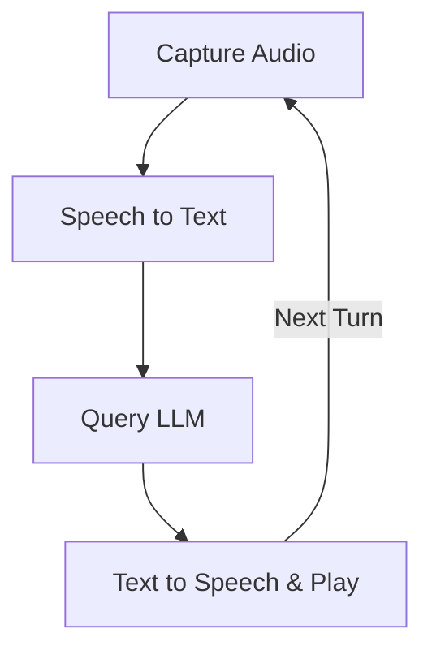

# PocketFlow 语音聊天

此项目演示使用 PocketFlow 构建的基于语音的交互式聊天应用程序。用户可以说出他们的查询，系统将使用 LLM 的语音回答进行响应，维护对话历史。

- 查看[Substack 文章教程](https://pocketflow.substack.com/p/build-your-own-voice-chatbot-from)了解更多！

## 功能特性

-   **语音活动检测（VAD）**：自动检测用户何时开始和停止说话。
-   **语音转文本（STT）**：使用 OpenAI 将语音音频转换为文本。
-   **LLM 交互**：使用 LLM（例如 GPT-4o）处理转录文本，维护对话历史。
-   **文本转语音（TTS）**：使用 OpenAI 将 LLM 的文本响应转换回可听语音。
-   **连续对话**：在响应后循环返回监听下一个用户查询，允许持续对话。

## 如何运行

1.  **设置您的 OpenAI API 密钥**：
    ```bash
    export OPENAI_API_KEY="your-api-key-here"
    ```
    确保设置了此环境变量，因为 STT、LLM 和 TTS 的实用脚本依赖于它。
    您可以测试单个实用函数（例如 `python utils/call_llm.py`、`python utils/text_to_speech.py`）以帮助验证您的 API 密钥和设置。

2.  **安装依赖项**：
    确保您已安装 Python。然后，使用 pip 安装所需的库：
    ```bash
    pip install -r requirements.txt
    ```
    这将安装 `openai`、`pocketflow`、`sounddevice`、`numpy`、`scipy` 和 `soundfile` 等库。

    **Linux 用户注意事项**：`sounddevice` 可能需要 PortAudio。如果您遇到问题，可能需要先安装它：
    ```bash
    sudo apt-get update && sudo apt-get install -y portaudio19-dev
    ```

3.  **运行应用程序**：
    ```bash
    python main.py
    ```
    按照控制台提示进行操作。当您看到"Listening for your query..."时，应用程序将开始监听。

## 工作原理

应用程序使用 PocketFlow 工作流程来管理对话步骤：



流程中每个节点的作用如下：

1.  **`CaptureAudioNode`**：从用户的麦克风录制音频。它使用语音活动检测（VAD）在检测到语音时开始录制，在检测到静音时停止录制。
2.  **`SpeechToTextNode`**：获取录制的音频数据，转换为合适格式，并发送到 OpenAI 的 STT API（gpt-4o-transcribe）获取转录文本。
3.  **`QueryLLMNode`**：获取用户的转录文本以及现有对话历史，并将其发送到 LLM（OpenAI 的 GPT-4o 模型）生成智能响应。
4.  **`TextToSpeechNode`**：从 LLM 接收文本响应，使用 OpenAI 的 TTS API（gpt-4o-mini-tts）将其转换为音频，并将音频播放回用户。如果对话设置为继续，它将转换回 `CaptureAudioNode`。

## 示例交互

当您运行 `main.py` 时：

1.  控制台将显示：
    ```
    Starting PocketFlow Voice Chat...
    Speak your query after 'Listening for your query...' appears.
    ...
    ```
2.  当您看到 `Listening for your query...` 时，请清晰地对着麦克风说话。
3.  当您停止说话时，控制台将显示更新：
    ```
    Audio captured (X.XXs), proceeding to STT.
    Converting speech to text...
    User: [Your transcribed query will appear here]
    Sending query to LLM...
    LLM: [The LLM's response text will appear here]
    Converting LLM response to speech...
    Playing LLM response...
    ```
4.  您将听到 LLM 的响应被大声说出。
5.  应用程序然后循环返回，您将再次看到 `Listening for your query...`，准备进行下一次输入。

对话以此种方式继续。要停止应用程序，您通常需要中断它（例如，在终端中按 Ctrl+C），因为它被设计为连续循环。
